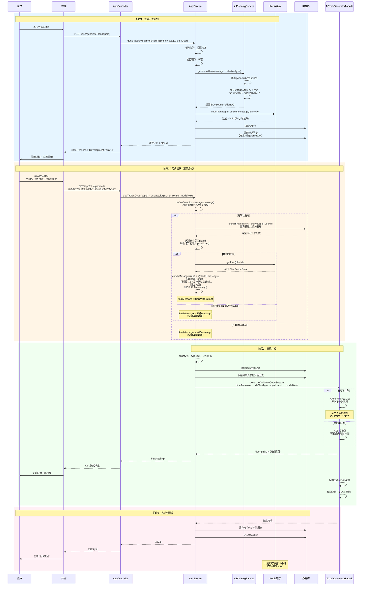
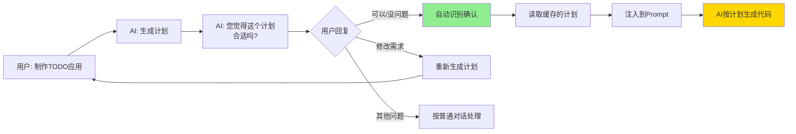

# 开发计划生成功能 - 完整流程图

## 方案B：计划作为代码生成的前置步骤



## 核心特性说明

### 1. 智能确认检测

**支持的确认关键词（15+种）：**
```java
"可以", "没问题", "好的", "行", "ok", "开始", "同意", 
"确认", "就这样", "按这个", "按计划", "继续", "没意见",
"开始生成", "生成代码", "开始吧", "继续吧"
```

**检测逻辑：**
- 转小写后模糊匹配
- 支持中英文混合
- 区分大小写不敏感

### 2. 计划关联机制

**标记格式：**
```
【开发计划|planId:123_456_1234567890】
{计划内容}
```

**提取逻辑：**
1. 查询最近10条AI消息
2. 按创建时间倒序
3. 查找包含 `【开发计划|planId:` 的消息
4. 正则提取planId

### 3. 增强Prompt模板

```
【重要】以下是用户已确认的开发计划，请严格按照此计划执行，不要重新规划：

{完整计划内容}

========================================

用户补充说明：{用户消息}

请现在开始按计划生成代码文件，直接创建文件，不要再输出计划内容。
```

### 4. 积分消耗

| 操作 | 积分消耗 | 说明 |
|------|---------|------|
| 生成计划 | 5积分 | 使用轻量级模型 |
| 代码生成 | 按类型 | HTML/多文件/Vue等 |
| **总计** | 5 + X | 分两次扣费 |

### 5. 缓存策略

- **存储位置**: Redis
- **Key格式**: `dev_plan:{appId}_{userId}_{timestamp}`
- **过期时间**: 24小时
- **清理策略**: 自动过期（可选手动删除）

## 异常处理

### 场景1：计划已过期
```
用户说"可以" → 查询Redis → 计划不存在
→ 按原逻辑处理（AI可能重新规划）
→ 日志记录: "planId xxx 对应的计划不存在或已过期"
```

### 场景2：未检测到确认
```
用户说"帮我改个颜色" → 不是确认关键词
→ 按原逻辑处理
→ 不读取计划缓存
```

### 场景3：计划注入失败
```
从Redis读取计划时异常
→ 捕获异常，返回原始message
→ 不影响代码生成流程
→ 错误日志记录
```

## 用户体验流程



## 技术优势

### ✅ 无需前端改造
- 完全由后端智能识别
- 前端无感知，保持原有交互
- 兼容现有所有功能

### ✅ 用户体验自然
- 像聊天一样确认
- 不需要点击额外按钮
- 支持多种表达方式

### ✅ 防止AI跑偏
- 明确的Prompt指令
- 计划内容完整注入
- 强制按计划执行

### ✅ 高容错性
- 计划过期自动降级
- 识别失败不影响正常流程
- 异常捕获不中断生成

## 测试用例

### 用例1：标准流程
```
1. 用户: "制作一个待办事项应用"
2. AI: [生成计划] "您觉得这个计划合适吗？"
3. 用户: "可以"
4. 系统: 检测到确认 → 读取计划 → 注入Prompt
5. AI: 按计划生成代码
```

### 用例2：修改需求
```
1. 用户: "制作一个待办事项应用"
2. AI: [生成计划] "您觉得这个计划合适吗？"
3. 用户: "加上优先级功能"
4. 系统: 不是确认消息 → 按普通对话处理
5. AI: 补充回复或重新规划
```

### 用例3：计划过期
```
1. 用户: "制作一个待办事项应用"
2. AI: [生成计划]
3. [用户24小时后回复]
4. 用户: "可以"
5. 系统: 计划已过期 → 按原逻辑处理
6. AI: 可能重新生成计划
```

### 用例4：跳过计划直接生成
```
1. 用户: "制作一个简单的登录页面"
2. 系统: 未调用生成计划接口
3. 系统: chatToGenCode → 无planId
4. AI: 按原逻辑生成（可能先输出计划）
```

## 监控指标

建议监控以下指标：
- 计划生成成功率
- 用户确认率（确认消息/计划生成）
- 计划关联成功率（提取planId成功/确认消息）
- 计划缓存命中率
- 平均确认时长（生成计划→确认）

---

**实现时间**: 2025年1月  
**实现方案**: 方案B - 计划作为代码生成的前置步骤  
**版本**: v1.0
