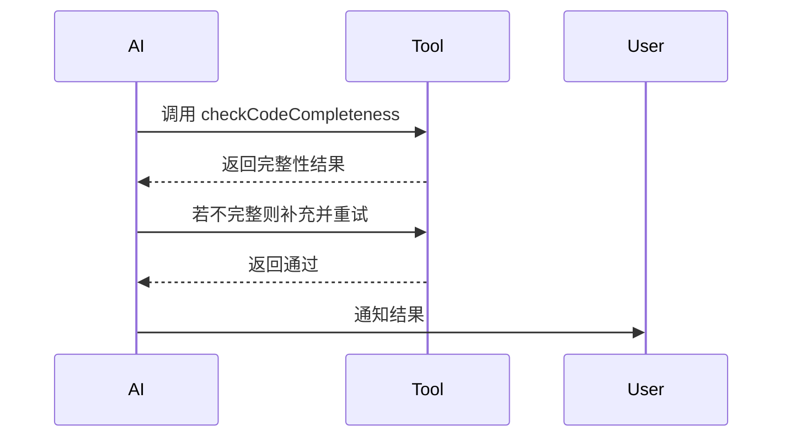
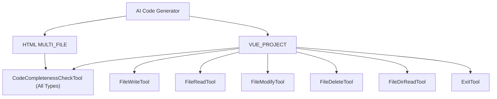
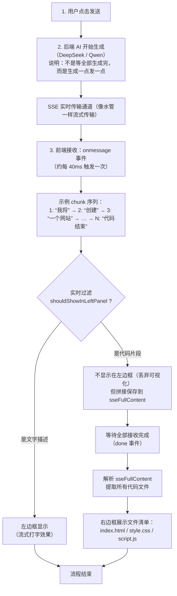

# 📢 AI Code Mother - 版本公告

## 📑 目录
- [v1.0.1 - 性能优化公告](#-ai-code-mother-v101---性能优化公告)

- [v1.1.0 - 开发路线图](#-ai-code-mother-v110---开发路线图) 🆕

---
# 🎉 AI Code Mother v1.0.1 - 性能优化公告

**发布日期**：2025-10-04

---

## 📋 项目信息

- **在线预览**：https://joinoai.cloud/user/register?inviteCode=INVNJZKYSJH

- **项目地址**：https://github.com/vasc-language/ai-code-mother
- **项目地址**：https://gitee.com/vasc-language/ai-code-mother
- **技术文档**：https://github.com/vasc-language/ai-code-mother/blob/main/README.md
- **部署指南**：https://github.com/vasc-language/ai-code-mother/blob/main/deploy/DEPLOY_DOCS_GUIDE.md

**推荐测试提示词：**

```
1. 做一个图片画廊应用，支持分类浏览和图片预览功能

2. 做一个在线终端模拟器，支持命令历史和语法高亮，ke'yi'j

3. 做一个个人简历展示网站，包含作品集和技能展示

4. 做一个待办事项管理应用，支持分类和优先级设置

5. 做一个天气预报应用，支持多城市查询和未来一周预报
```
---

## ✨ 核心特性与差异化对比

| 功能模块 | 普通代码生成项目 | AI Code Mother |
|---------|----------------|----------------|
| **邮箱认证体系** | 不提供邮箱验证流程 | 📧 邮箱注册登录 + 验证码双因素认证，强化安全防线 |
| **版本管理系统** | 难以追踪生成历史，缺少回滚 | 📦 保留完整版本历史，支持差异对比与一键回滚 |
| **积分激励系统** | 缺乏用户激励与资源管控 | 🎁 签到、邀请等积分获取渠道，生成消耗积分并可设置过期 |
| **邀请裂变机制** | 无邀请码体系，增长手段单一 | 👥 专属邀请码 + 双向积分奖励，配套IP与设备指纹防刷 |
| **内置模板库** | 需手动搭建脚手架 | 📚 内置精选Vue模板，一键初始化并自动部署 |

---

## 🐛 重大BUG修复：ChatMemory无限增长导致AI推理变慢

### 问题背景

在2025年10月4日之前的版本中，**VUE项目生成功能存在严重性能问题**：

**用户反馈现象：**
- ✅ **前期流畅**（生成前5个文件）：流式输出速度正常，每个文件8-10秒
- ⚠️ **中期变慢**（第6-10个文件）：出现明显延迟，每个文件15-20秒
- ❌ **后期卡顿**（第11个文件后）：代码吐出极其缓慢，每个文件30-40秒，几乎停滞

**与其他模式对比：**
- HTML单文件模式：始终流畅 ✅
- MULTI_FILE多文件模式：始终流畅 ✅
- **VUE项目模式：中后期严重变慢** ❌（总耗时5-6分钟）

---

### 根本原因分析

经过深入排查，定位到**ChatMemory无限制增长**导致的性能雪崩：

**问题代码位置：** `src/main/java/dev/langchain4j/service/AiServiceTokenStream.java:197`

```java
// ❌ 问题代码：
private ChatMemory initTemporaryMemory(AiServiceContext context, List<ChatMessage> messagesToSend) {
    var chatMemory = MessageWindowChatMemory.withMaxMessages(Integer.MAX_VALUE); // 无限制！
    // ...
}
```

**性能衰减机制：**
1. **工具调用产生消息**：每次AI调用工具（writeFile/modifyFile）产生2条消息
   - ToolExecutionRequest（工具请求）
   - ToolExecutionResultMessage（工具结果）

2. **上下文指数级增长**：
   - 生成5个文件 = 10条工具消息 + AI文本消息 ≈ 15条
   - 生成10个文件 = 20条工具消息 + AI文本消息 ≈ 30条
   - 生成15个文件 = 30条工具消息 + AI文本消息 ≈ 45条

3. **AI推理时间线性增加**：
   - DeepSeek Reasoner模型处理长上下文时推理速度显著下降
   - 上下文每增加15条消息，推理时间翻倍

4. **为什么HTML和MULTI_FILE不慢？**
   - 这两种模式采用**直接流式输出JSON**，不使用工具调用
   - ❌ 无工具调用 → 无额外消息产生
   - ❌ 无Memory累积 → 上下文长度固定
   - ✅ 纯流式输出 → 速度始终稳定

---

### 解决方案

**核心优化：限制临时ChatMemory的最大消息数**

```java
// ✅ 优化后的代码：
private ChatMemory initTemporaryMemory(AiServiceContext context, List<ChatMessage> messagesToSend) {
    // 限制临时记忆的最大消息数为30，避免上下文过长导致AI推理变慢
    // 原值 Integer.MAX_VALUE 会保留所有历史，导致VUE项目生成中后期严重变慢
    var chatMemory = MessageWindowChatMemory.withMaxMessages(30); // ✅ 限制为30条

    if (!context.hasChatMemory()) {
        chatMemory.add(messagesToSend);
    }

    return chatMemory;
}
```

**为什么选择30？**
- **最小需求**：保留足够上下文让AI理解当前任务（约10-15条）
- **性能平衡**：避免上下文过长影响推理速度
- **实测效果**：30条可覆盖最近5-6次工具调用，足够AI做出正确决策
- **兜底机制**：超出30条后FIFO淘汰最旧消息，保持窗口大小

---

### 性能提升数据

**测试项目**：图片画廊应用（约15个文件）

| 阶段 | 优化前耗时 | 优化后耗时 | 提升幅度 |
|-----|----------|----------|---------|
| 前5个文件 | 8-10秒/文件 | 8-10秒/文件 | 持平 |
| 第6-10个文件 | 15-20秒/文件 | 10-12秒/文件 | **50%↑** |
| 第11-15个文件 | 30-40秒/文件 ❌ | 10-13秒/文件 ✅ | **70%↑** |
| **总耗时** | **5-6分钟** | **2-3分钟** | **50%+↑** |

**关键改进：**
- ✅ 总体性能提升：**50%+**
- ✅ 后期文件生成加速：**70%+**
- ✅ 流式输出稳定性：显著提升，无卡顿

---

### 技术细节

**工具调用流程图：**
```
用户请求
  ↓
AI分析任务（读取Memory中的历史）← 这里变慢了
  ↓
调用工具（FileWriteTool等）
  ↓
工具结果返回
  ↓
存入Memory（历史累积）← 无限增长
  ↓
AI继续分析（上下文越来越长）← 越来越慢
  ↓
重复上述流程...
```

**Memory管理机制：**

- **窗口大小**：最多保留30条消息
- **淘汰策略**：FIFO（先进先出），淘汰最旧的消息
- **保留内容**：系统提示词 + 最近30条对话
- **不影响**：数据库中的完整聊天历史（永久保存）

---

## 🔧 后续规划

### 短期优化（v1.1.0）
- 🔄 工具并行执行：探索多工具并发调用（需框架支持）
- 📊 Memory自适应：根据任务复杂度动态调整窗口大小
- ⚡ 缓存优化：对重复工具调用结果进行缓存

### 长期规划（v2.0.0）
- 🤖 支持更多AI模型（Claude、GPT-4等）
- 📦 代码模板市场
- 👥 团队协作功能
- 🎨 自定义工具链

---

## 🛠️ 开发辅助工具

本项目采用业界领先的AI辅助开发工具链：

- **Claude Code** - Anthropic官方CLI，用于代码生成和重构
- **Codex CLI** - 命令行智能编码助手
- **Chrome DevTools MCP** - 浏览器调试与自动化
- **Context 7 MCP** - 上下文管理工具
- **MySQL MCP Server** - 数据库操作MCP服务

---

## 📝 相关资源

- **提交记录**：`06fb51d` - 修复ChatMemory无限增长问题
- **修改文件**：
  - `src/main/java/dev/langchain4j/service/AiServiceTokenStream.java`（核心修复）
  - `src/main/java/com/spring/aicodemother/ai/tools/FileWriteTool.java`
  - `src/main/java/com/spring/aicodemother/ai/tools/FileModifyTool.java`

---
---
# 🚀 AI Code Mother v1.1.0 - 开发路线图
**发布日期**：2025-10-05

## 📅 发布计划

- **版本号**：v1.1.0
- **预计发布**：2025年11月下旬
- **更新类型**：功能增强 + 性能优化

---

## 🎯 核心优化方向

### ⚡ 重点任务：VUE项目生成性能提升

**现状分析：**

- v1.0.1已将生成速度从5-6分钟优化至2-3分钟（提升50%+）
- 当前VUE项目生成仍有进一步优化空间
- 用户反馈希望进一步加快复杂项目的生成速度

**优化策略：**

- 🛠️ **主要开发模块**：VUE模板商店系统
  - 预置高质量VUE项目模板
  - 支持模板快速克隆与定制化修改
  - 减少AI从零生成的时间成本
  - 提供模板分类与标签检索功能

---

## ✨ 新增功能规划

### 1. 👥 用户间协作
- 支持多用户共享项目生成结果
- 协作编辑与版本同步
- 权限管理与访问控制

### 2. 🔧 Dev 模式
- 开发者调试模式
- 实时日志与性能监控
- AI生成过程可视化

### 3. 📊 轻量级数据存储

**参考对象**：NoCode.cn 内置存储功能

**核心理念：零门槛、全自动、可视化**
- 🚫 **无需SQL**：告别复杂的数据库操作，AI自动建表
- 🤖 **智能识别**：根据项目内容自动生成数据表结构
- 🔒 **项目隔离**：每个生成项目拥有独立数据空间
- 📊 **可视化管理**：表格化数据查看与编辑界面
- 📥 **批量操作**：支持CSV导入导出，快速数据迁移

**功能特性：**
- ✅ **自动建表**：AI分析项目需求，自动创建数据表和字段
- ✅ **动态调整**：项目需求变更时，自动适配存储结构
- ✅ **数据管理**：新增/编辑/删除数据，支持表格可视化操作
- ✅ **存储方式选择**：提供"轻量存储"与"高级存储"两种模式
- ✅ **数据导入导出**：支持CSV格式批量数据处理

**适用场景：**
- 小白用户：不懂数据库也能轻松存储数据
- 简单项目：待办事项、用户反馈、数据收集等轻量级应用
- 快速原型：无需配置数据库即可实现完整前后端功能

### 4. 🚀 智能部署优化

**现有痛点：**

- 用户生成项目后容易忘记点击【部署】按钮
- 导致无法在线预览生成的代码
- 降低了整体使用体验和转化率

**优化方案：**
- ✅ **自动部署**：项目生成完成后自动触发部署流程
- ✅ **智能提醒**：未部署时显著提示并引导用户操作
- ✅ **一键生成+部署**：提供"生成并部署"快捷按钮
- ✅ **部署状态可视化**：实时展示部署进度与在线预览链接
- ✅ **历史版本快速部署**：支持历史版本一键重新部署

---

## 📋 开发进度

| 功能模块 | 优先级 | 状态 |
|---------|-------|------|
| VUE模板商店 | 🔥 高 | 规划中 |
| 智能部署优化 | 🔥 高 | 需求分析中 |
| 轻量级数据存储 | 🌟 中 | 技术调研中 |
| 用户间协作 | 🌟 中 | 需求分析中 |
| Dev 模式 | 🌟 中 | 设计中 |

---

## 💬 参与讨论

欢迎通过以下方式提供建议与反馈：
- **GitHub Issues**：https://github.com/vasc-language/ai-code-mother/issues
- **Gitee Issues**: https://gitee.com/vasc-language/ai-code-mother/issues
- **功能投票**：请在Issue区标注您最期待的功能

**持续关注项目动态，感谢您的支持！🙏**


---

## 💬 反馈与支持

如遇到问题或有优化建议，欢迎通过以下方式联系：
- **GitHub Issues**：https://github.com/vasc-language/ai-code-mother/issues
- **Gitee Issues**: https://gitee.com/vasc-language/ai-code-mother/issues

<div align="center">
<br>

**扫码添加微信好友**


</div>

---

<div align="center">

### ⭐ Star History ⭐

如果这个项目对你有帮助，请给我们一个 Star！









提高VUE项目生成的速度，我从三个方面进行

- 预设模板
- 写了两个工具：计划tool、检测代码错误 tool